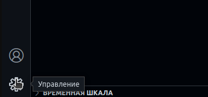
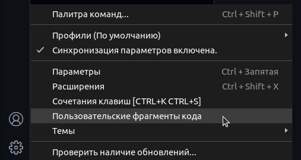
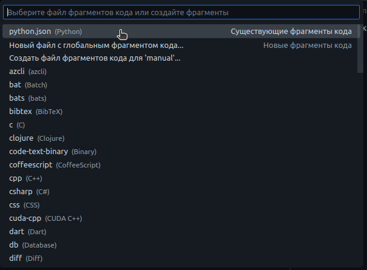
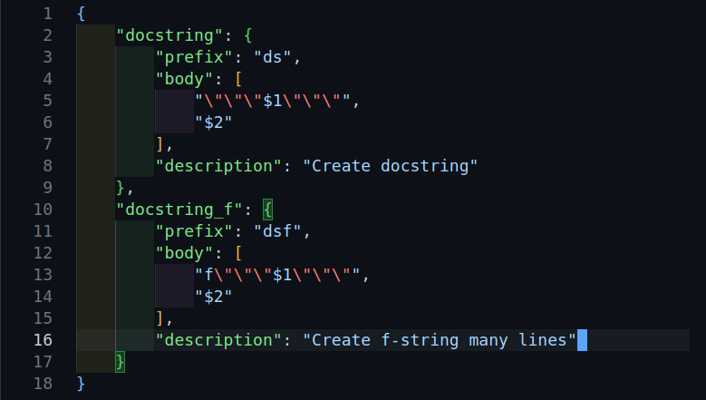

# Создание снипетов (en.: snippets)

Снипеты - полезная возможность в VS Code.
Порой хочется как-нибудь автоматизировать свой процесс форматирования кода,
а снипеты этому очень способствуют.

## Так что же нужно для создания сниппета

В интернете полно информации на эту тему, я же сделал небольшую выжимку и создал свои.

1. Откройте "Управление"

2. Выберите "Пользовательские фрагменты кода"

3. В открывшемся меню выбираю python, я собираюсь создать сниппет для этого языка. Сниппет будет достпупен мне при редактировании файлов Python (.py) 

4. В открывшемся файле есть немного информации, которая может пригодиться. Напишу то что мне нужно.

- строка 2 = указываю имя сниппета  `"docstring"`
- строка 3 = комбинация символов для вызова сниппета
- строки 4-7 = описание того, что должно получится:
 `$1` и `$2` = положение курсора после того как набрать комбинацию символов и вызвать кнопкой "таб"(Tab->) `$1` - в первый раз нажатия кнопки, `$2` - во второй раз.
- срока 8 = описание сниппета

Теперь если перейти в файл Python(.py), ввести `ds` и нажать кнопку таб(Tab->) один раз, появится конструкция с шестью ковычками и курсором в центре.

#### Второй сниппет написан точно так же